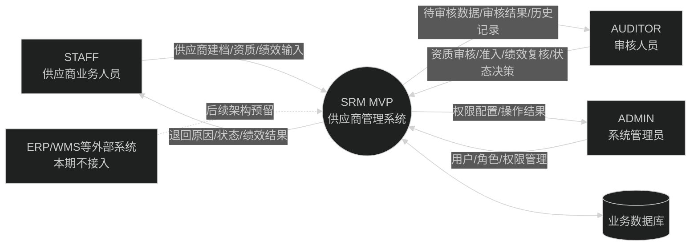

```mermaid
%%{init: {'theme': 'dark'}}%%
flowchart LR
    STAFF["STAFF<br/>供应商业务人员"]
    AUDITOR["AUDITOR<br/>审核人员"]
    ADMIN["ADMIN<br/>系统管理员"]
    SRM(("SRM MVP<br/>供应商管理系统"))
    DB[(业务数据库)]

    STAFF -->|供应商建档/资质/绩效输入| SRM
    SRM -->|退回原因/状态/绩效结果| STAFF
    AUDITOR -->|资质审核/准入/绩效复核/状态决策| SRM
    SRM -->|待审核数据/审核结果/历史记录| AUDITOR
    ADMIN -->|用户/角色/权限管理| SRM
    SRM -->|权限配置/操作结果| ADMIN
    SRM <--> DB

    ERP["ERP/WMS等外部系统<br/>本期不接入"]
    ERP -.->|后续架构预留| SRM
```